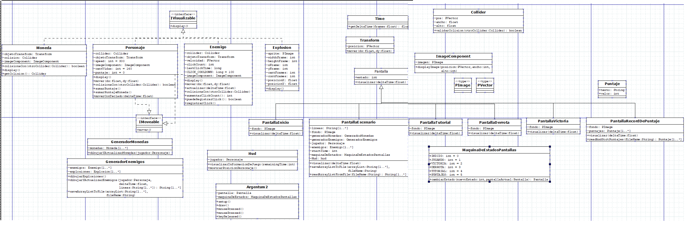

# TUDIVJ - Fundamentos de programación orientada a objetos

## Trabajo práctico final, grupo: ArrozConLeche

### Diagrama DIA

### Trabajo Práctico Final - Requerimientos del Segundo entregable

### Trabajo Final Enunciado - Requerimientos Primer Entregabl

